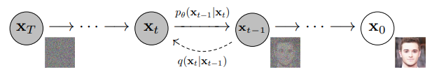

# Image Generation with Diffusion Models
Project work for the Deep Learning course BMEVITMMA19, semester 2023/24/1.

## Team

Name: **Lambda**

Members:

| Name            | Neptun code |
|-----------------|-------------|
| Somorjai Márk   | FAFSAG      |
| Szommer Zsombor | MM5NOT      |
| Telbisz Csanád  | ESV6L2      |

## Introduction

The goal of the project is to generate realistic images using diffusion models. We have chosen the *Denoising Diffusion Probabilistic Model* (DDPM) scheme. We have implemented the models based on the following related works:

[[1](https://arxiv.org/abs/2006.11239)] Denoising Diffusion Probabilistic Models by Jonathan Ho, Ajay Jain and Pieter Abbeel (2020)

[[2](https://huggingface.co/blog/annotated-diffusion)] The Annotated Diffusion Model by Niels Rogge and Kashif Rasul (2022)

[[3](https://keras.io/examples/generative/ddim/)] Denoising Diffusion Implicit Models by András Béres (2022)

[[4](https://keras.io/examples/generative/ddpm/)] Denoising Diffusion Probabilistic Model by Aakash Kumar Nain (2022)

[[5](https://arxiv.org/abs/1505.04597)] U-Net: Convolutional Networks for Biomedical Image Segmentation by Olaf Ronneberger, Philipp Fischer and Thomas Brox (2015)

Primarily, we use the [Oxford 102 Flower Dataset](https://www.robots.ox.ac.uk/~vgg/data/flowers/102/) for the evaluation of our work: we have optimized our model for image generation. On the other hand, we have also tested our implementation with the [Oxford-IIIT Pet Dataset](https://www.robots.ox.ac.uk/~vgg/data/pets/).

## Theoretical Background

The base idea of a diffusion model is to learn how to gradually denoise data step-by-step starting from pure (Gaussian) noise. The model is trained to predict the next step of the denoising process. To achieve this, Gaussian noise is added gradually to the input images, and the neural network learns this noise at each step. That is, the input of the network is a (noisy) image and a noise level, and the network has to predict last added noise. This way, the network can predict the noise component of a given image at each noise level. Thus, if we have _T_ steps such that we end up with (something like) pure noise after adding noise _T_ times, the network can denoise it step-by-step: that is, it can generate an image from pure noise. We use 500 steps in our implementation.

Figure 1 illustrates this process: _t_ represents the noise level, _q_ the noising step, and _pθ_ the denoising step (the neural network prediction). The original image is _x0_, and its completely noised version is _xT_. The goal is to predict _xt-1_ from _xt_.

 
Figure 1: Graphical model of the diffusion process, source: [1]

## Neural network

The input of the neural network is a noisy image _xt_ and the noise level _t_. The output is the predicted noise added at the previous step (from _xt-1_ to _xt_). Then, the predicted _x't-1_ is calculated from _xt_ by subtracting the predicted noise. The loss is calculated as the difference between the predicted _x't-1_ and the original _xt-1_.

As for the architecture of the neural network, we have implemented a U-Net [5] which is similar to an Autoencoder, that is, it has a "bottleneck". The architecture of the U-Net is illustrated in Figure 2. First, the input data is downsampled, then upsampled. At each level, residual blocks are used. The residual blocks are composed of convolutional layers. Furthermore, skip connections are used to connect the downsampling and upsampling layers having the same resolution in order to facilitate gradient flow. The skip connections are concatenated with the output of the upsampling layers.

 
Figure 2: U-Net architecture, source: [5]

As the baseline model, we have implemented a simple version of the U-Net that basically follows the above architecture. However, it does not have any optimizations. Thus, its performance was rather poor.

For the final solution, we have incrementally enhanced the baseline model with the following features:
- We use multiple residual blocks at each level.
- We use group normalization in the residual blocks.
- Sinusoidal time embedding is used to encode the noise level.
- Exponential moving average is used to update the weights of the model.

We have also optimized the hyperparameters such as the learning rate, the number of epochs, the activation function, etc.

## Implementation

We have implemented the models in Python using TensorFlow. The project is available on GitHub: https://github.com/SPLambda/diffusion. The code is available in the `solution.ipynb` notebook.

Containerization...

## Evaluation

### Datasets

### Evaluation Criteria

### Results in Numbers

### Image Generation

- 4x8 image grid
- denoise process: static image steps, animated gif

### Evaluation on the Pets Dataset

## Conclusion

### Lessons learned

- activation function
- group normalization
- small optimizations
